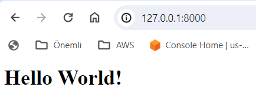

# VagrantChallenge2
Vagrant Challenge Python Flask app Gunicorn

## Vagrant Nedir?

Vagrant, Yazılım geliştirme projeleri için hızlı ve tekrarlanabilir bir şekilde sanal makineler oluşturulmasını sağlayan araçtır.


## Proje Adımları

1. GitHub'da repo oluşturuldu ve lokale clone edildi.
2. Lokalde ilgili klasörün içine gidildi:

    ```bash
    cd Desktop/VagrantChallenge2/
    ```

3. Vagrant dosyası (`Vagrantfile`) oluşturuldu:

    ```bash
    vagrant init ubuntu/focal64
    ```
    vagrant init komutu, bulunduğunuz konumda örnek bir vagrantFile oluşturur. Bu örnekte, Ubuntu 20.04 LTS sanal makinesi kullanıldı.
    Bir diğer yöntem olarak Vagrantfile'ı kendiniz oluşturabilirsiniz, bunun için aşağıdaki komutları girebilirsiniz.

    ```ruby
    Vagrant.configure("2") do |config|
      config.vm.box = "ubuntu/focal64"
    end
    ```

## Vagrantfile Dosyası

```ruby
Vagrant.configure("2") do |config|

  config.vm.box = "ubuntu/focal64"

  config.vm.network "public_network"

  config.vm.provision "file", source: "./app", destination: "~/app"
  
  config.vm.provision "shell", inline: <<-SHELL
    apt-get update
    sudo apt-get install -y python3 python3-pip
    sudo pip3 install flask gunicorn
  SHELL
end

```
DHCP den ip alabilmesi için sanal makinenin network ayarı public olarak yapıldı.

```ruby
config.vm.network "public_network"
```
Aşağıdaki satır ile sanal makineye dosyaların kopyalanmasını sağlar. Kaynak (source) ve hedef (destination) dizinler belirtilir. 

```ruby
  config.vm.provision "file", source: "./app", destination: "~/app"
```

```ruby
  config.vm.provision "shell", inline: <<-SHELL
    apt-get update
    sudo apt-get install -y python3 python3-pip
    sudo pip3 install flask gunicorn
  SHELL
```
- apt-get update: Paket yöneticisinin paket listesini günceller.

- sudo apt-get install -y python3 python3-pip: Python 3 ve pip'in kurulumunu yapar.

- sudo pip3 install flask gunicorn: Flask ve Gunicorn paketlerini kurar. 

Gunicorn, Python uygulamalarının web sunucusu olarak çalıştırılmasını sağlar ve bu durumda bir Flask uygulamasını çalıştırmak için kullanılmaktadır.

1. Sanal makineyi başlatmak için bu komut çalıştırılır

    ```bash
    vagrant up
    ```
    
    

2. Sanal makineye SSH ile bağlanmak için:

    ```bash
    vagrant ssh
    ```

3. Uygulama dizinine gidilerek, uygulama Gunicorn ile çalıştırılır.

   ```bash
   gunicorn --bind 0.0.0.0:8000 app:app
   ```
	--bind 0.0.0.0:8000 Bu, Gunicorn sunucusunun hangi IP adresi ve port üzerinde dinleyeceğini belirtir. app:app Bu, Gunicorn sunucusunun çalıştırılacak uygulamayı belirtir. 
    

4. Sanal makine ip'sini öğrenmek için `ifconfig` komutu kullanılır. İlgili ip ve port numarası web browser üzerinden girilerek test edilir.

    

5. Sanal makineyi kapatmak için:

    ```bash
    vagrant halt
    ```

6. Sanal makinayı tamamen silmek için:

    ```bash
    vagrant destroy
    ```

